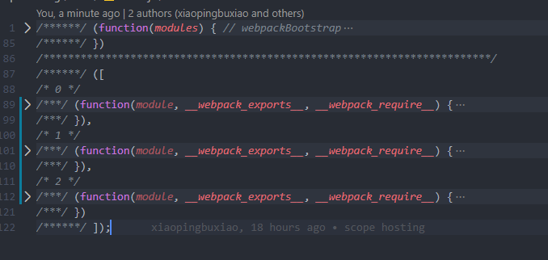
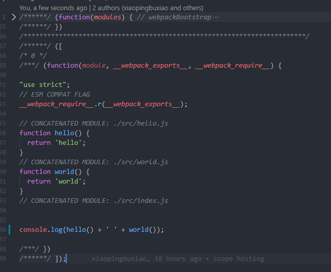

### 自动清理构建目录
```
rm -rf ./dist && webpack
rimraf ./dist && webpak
```
更加推荐使用 `clean-webpack-plugin` 默认会删除 `output` 指定的输出目录。

[更多关于clean-webpack-plugin使用](https://www.npmjs.com/package/clean-webpack-plugin)


### css 的增强

```shell
npm install postcss-loader autoprefixer -D
```
同时 `webpack` 的 `css` 编译中添加 `postcss-loader`:
```js
module:{
  rules:[
    {
      test: /\.(scss|css)$/,
      use: [
        // 'style-loader',
        miniCssExtractPlugin.loader,
        'css-loader',
        'postcss-loader',
        'sass-loader'
      ]
    },
  ]
}
```

新建 `postcss.config.js`
```js postcss.config.js
module.exports = {
  plugins: [
    require('autoprefixer')
  ]
}
```
新建 `.browserslistrc`
``` .browserslistrc
> 1%
last 2 versions
```

### css 增强（通过 webpack 转换rem 适配）

```js
npm install px2rem-loader lib-flexible -D
```
```js webpack.config.js
module:{
  rules:[
    {
      test:/\.(scss|css)$/,
      use:[
        'style-loader',
        'css-loader',
        'sass-loader',
        {
          loader:'px2rem-loader',
          options:{
            remUnit:75, // 750设计稿
            remPrecesion:8 // 精确度
          }
        }
      ]
    },
  ]
}
```

### 资源内联
代码层面意义：
* 页面框架的初始化脚本（如引入`lib-flexible`）
* 上报相关打点
* css 内联避免页面闪动  

请求层面意义:
* 减少 HTTP 网络请求数量 (小的图片或者字体内联`url-loader `)

#### HTML 和 JS 内联
使用 `raw-loader` 做资源的内联是不能使用过高版本。
```shell
npm i raw-loader@0.5 -D
```
```js
${ require('raw-loader!./meta.html')}
<script>
 ${ require('raw-loader!babel-loader!./node_modules/lib-flexible/flexible.js')}
</script>
```
#### css 的内联
方案一：借助`style-loader`来完成
[具体查看style-loader配置项](https://www.npmjs.com/package/style-loader)

方案二：借助 `html-inline-css-webpack-plugin`
[具体查看html-inline-css-webpack-plugin](https://www.npmjs.com/package/html-inline-css-webpack-plugin)


### 多页面的打包 MPA
多页面打包基本思路:      
每个页面对应一个`entry`，一个`html-webpack-plugin`    
缺点： 每次新增或者删除页面需要修改 `webpack`配置     
**多页面打包通用方案：**     
动态获取`entry`和设置`html-webpacl-plugin`数量。
利用`glob.sync`
```js
enrty:glob.sync(path.join(__dirname,'./src/*/index.js'))
```
```shell
npm install glob -D
```
相当于市使用了一个约定俗成的，每一个页面的入口都建`index`。同时`src`下面的没一个文件名为多页面中每个页面的名称.
```js 
const setMPA = () => {
  const entry = {}
  const htmlWebpackPlugins = []
  const entryFiles = glob.sync(path.join(__dirname, './src/*/index.js'))
  Object.keys(entryFiles).map(index => {
    console.log()
    const entryFile = entryFiles[index]
    const match = entryFile.match(/src\/(.*)\/index.js/)
    const pageName = match && match[1]
    entry[pageName] = entryFile

    htmlWebpackPlugins.push(new htmlWebpackPlugin({
      template: path.join(__dirname, `./src/${pageName}/index.html`),
      filename: `${pageName}.html`,
      chunks: [`${pageName}`],
      inject: true,
      minify: {
        html5: true,
        collapseWhitespace: true,
        preserveLineBreaks: false,
        minifyCSS: true,
        minifyJS: true,
        removeComments: false
      }
    }))
  })

  return {
    entry,
    htmlWebpackPlugins
  }
}

const { entry, htmlWebpackPlugins } = setMPA();
```

[多页面demo(此时只对prod进行了处理)](https://github.com/xiaopingbuxiao/webpack/tree/master/MPA)


### webpack 中开启 source map

`source map`关键字:    
* eval：使用 eval 包裹模块代码
* source map：产生 .map 文件
* cheap：不包含列信息
* inline：将 .map 作为 DataURL 嵌入，不单独生成 .map 文件
* module：包含 loader 的 sourcemap

[更多sourceMap类型](https://webpack.docschina.org/configuration/devtool/)

对于 `js` 的 `sourceMap` 只需要设置:
```js 
module.exports={
  devtool:'source-map'
}
```
对于 `css` 的 `source-map` 根据 [css-loader](https://www.npmjs.com/package/css-loader) 来设置。
 

 ### 基础库的分离

思路：将 `react`、`react-dom` 等基础包通过`cdn`引入，不打入`bundle`中      
方法：使用`html-webpack-externals-plugin`
```shell
npm install --save-dev html-webpack-externals-plugin
```
增加配置如下:
```js
plugins;[
  new HtmlWebpackExternalsPlugin({
    externals: [
      {
        module: 'react',
        entry: '//unpkg.com/react@16/umd/react.development.js',
        global: 'React',
      },
      {
        module: 'react-dom',
        entry: '//unpkg.com/react-dom@16/umd/react-dom.development.js',
        global: 'ReactDOM',
      },
    ],
  })
]
```
**此处需要注意的是`html`的模版中需要手动引入 cdn 资源**


也可以使用`SplitChunksPlugin`来进行基础包的分离。将`React`和`ReactDOm`优化为一个公共包:

```js
optimization: {
  splitChunks: {
    cacheGroups: {
      commons: {
        test: /(react|react-dom)/,
        name: 'React_ReactDOM',
        chunks: 'all'
      }
    }
  }
},
```
同时增加`html-webpack-plugin`中的`chunks`：
```js
const setMPA = () => {
  const entry = {}
  const htmlWebpackPlugins = []
  const entryFiles = glob.sync(path.join(__dirname, './src/*/index.js'))
  console.log(entryFiles)

  Object.keys(entryFiles).map(index => {
    console.log()
    const entryFile = entryFiles[index]
    const match = entryFile.match(/src\/(.*)\/index.js/)
    const pageName = match && match[1]
    entry[pageName] = entryFile

    htmlWebpackPlugins.push(new htmlWebpackPlugin({
      template: path.join(__dirname, `./src/${pageName}/index.html`),
      filename: `${pageName}.html`,
      /* 新增 React_ReactDOM 的公共包 */
      chunks: ['React_ReactDOM',`${pageName}`],
      inject: true,
      minify: {
        html5: true,
        collapseWhitespace: true,
        preserveLineBreaks: false,
        minifyCSS: true,
        minifyJS: true,
        removeComments: false
      }
    }))
  })

  return {
    entry,
    htmlWebpackPlugins
  }
}
```


### 利用 SplitChunksPlugin 进行公共脚本的分离

`webpack4` 内置了此插件。      
`chunks` 参数说明:
* async 一步引入的库进行分离(默认)
* initial 同步引入的库进行分离
* all 所有引入的库进行分离(默认)

```js
optimization: {
  splitChunks: {
    minSize: 0,
    cacheGroups: {
      React_ReactDOM: {
        test: /(react|react-dom)/,
        name: 'React_ReactDOM',
        chunks: 'all'
      },
      commons: {
        name: 'commons',
        chunks: 'all',
        minChunks: 2
      }
    }
  }
},
```
**此时有一个坑，一定注意优化优化后的文件名需要添加到 `html-webpack-plugin` 插件的`chunks`中，如果忘记添加，容易出现，本地开发时正常，打出的包中因为少引入了资源而引起报错**

[demo地址](https://github.com/xiaopingbuxiao/webpack/tree/master/splitChunks)

[SplitChunksPlugin更详细的文档](https://webpack.docschina.org/plugins/split-chunks-plugin/)


### tree-sshaking 原理

**概念：**1个模块可能有多个方法，只要对其中的某个方法使用到了，则整个文件都会被大道 `bundle` 里面去，`tree shaking` 就是只要用到的方法打入到 `bundle`，没用到的方法会在`ufligy`阶段被擦除掉。      
**使用：** `webpack` 默认支持，在`.bablerc`中设置 `modules:false` 即可。`production mode`的情况下默认开启。     
**要求：** 必须是 ES6 的语法， CJS 的方式不支持。

DCE (Dead code elimination) 的代码不会被打包：  
* 代码不会被执行，不可到达
* 代码执行的结果不会被用到
* 代码只会影响死变量(只写不读)

#### tree-shaking 原理
利用 ES6 模块特点：
* 只能作为模块顶层的语句出现
* import 的模块名只能是字符串常量
* import binding 是 immutable 的   

代码擦除： uglify 阶段删除无用代码

新建一个 `tree-shaking.js` 在 `search.js` 中引用。此时，如果设置`mode:'none'`。打包出来的代码中全局搜索会发现，`tree-shaking.js`中的代码全部被打包进了`search.js`。但是但我们开始`mode:'produciton'`的时候，如果是引用了但是没有执行，或者执行结果只赋值给了死变量也是不会被打包进去的。[具体demo](https://webpack.docschina.org/plugins/split-chunks-plugin/))

**此处只是一个最简单的使用，事实上`tree-shaking` 的使用中存在很多的坑，用到时更多的处理**

#### Scope Hoisting

默认情况下 `webpack` 的打包，会将引用的各个模块打包进一个匿名函数中，这会生成很多无用的代码，同时大量闭包的引用会造成资源的浪费。
默认情况下 `webpack` 在生产环境会自动开启。手动设置`mode:'none'`。打包结果如下：
```js
import { hello } from './hello'
import { world } from './world'
console.log(hello() + ' ' + world())
```
打包后如图:   


手动开启`scope-hoisting`(`mode`还是设置为'none'):
```js
plugins:[
  new webpack.optimize.ModuleConcatenationPlugin(),
]
```
打包后如图:   


[更多scope-hoisting内容](https://www.webpackjs.com/plugins/module-concatenation-plugin/)


### 代码分割
意义：对于大的 Web 应用来讲，将所有的代码都放在一个文件中会使得首屏加载过慢。webpack 有一个功能就是将代码库分割成 chunks(语块)。当代码运行到需要他们的时候在进行加载。

适用场景:
* 抽离相同的代码到一个共享块
* 脚本懒加载，使得初始下载的代码更小

#### 懒加载 js 脚本方式
* CommonJS: require.ensure
* ES6: 动态 import (目前还没有原生支持，需要 babel 转换)

动态 import 使用 ：      
1. 安装 babel 插件
```shell
npm install --save-dev @babel/plugin-syntax-dynamic-import
```
2. 
```js  .babelrc
{
  "plugins": ["@babel/plugin-syntax-dynamic-import"]
}
```

```js search.js
import React from 'react'
import ReactDOM from 'react-dom'
import { common } from '../../common'
import './search.scss'
import logo from './img/react-logo.png'
import { a } from './tree-shaking'

var str = a()
console.log(common())
class Search extends React.Component {
  constructor() {
    super()
    this.state = {
      Text: null
    }
  }
  loadComponent() {
    import('./Text.jsx').then((Text) => {
      console.log(Text.default)
      this.setState({
        Text: Text.default
      })
    })
  }
  render() {
    const { Text } = this.state
    return (
      <div className='search-Text'>
        {
          Text ? <Text></Text> : null
        }
        
        <span>搜索页面的html{str}</span>
      </div>
    )
  }
}
ReactDOM.render(
  <Search />,
  document.querySelector('#app')
)
```
```js text.js
import React from 'react'
export default() => <div>动态import组件text</div>
```
此时打包之后已经可以看到。点击图片是会进行一个动态的加载 js 的请求。以此来达到分包优化的效果。
[具体demo地址](https://github.com/xiaopingbuxiao/webpack/tree/master/splitChunks)


### 打包一个库
```js
const terserWebpackPlugin = require('terser-webpack-plugin')

module.exports = {
  entry: {
    "large-number": './src/index.js',
    "large-number.min": './src/index.js'
  },
  main:'index.js',
  mode: 'none',
  output: {
    filename: '[name].js',  // 文件名称
    library: 'largeNumber', // 打包之后的库名
    libraryTarget: 'umd',   // 支持的引入方式
    libraryExport: 'default' 
  },
  optimization: {
    minimize: true,
    minimizer: [
      new terserWebpackPlugin({
        include: /\.min\.js$/
      })
    ]
  }
}
```

