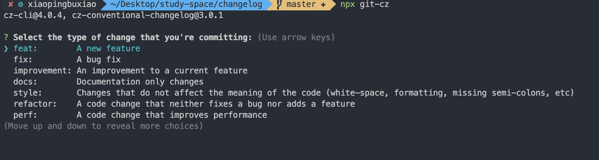

### 构建配置抽离成npm
* 通过多个配置文件管理不同环境的构建
* 将构建配置设计成一个库，如：`neutrino、webpack-blocks`
* 抽离成一个工具进行管理：如: `create-react-app`,`kyt`,`nwb`
* 将所有的配置放在一个文件，通过`--env`参数来控制分支选择


[涵盖基本功能的demo](https://github.com/xiaopingbuxiao/webpack/tree/master/my-project)


### 添加测试文件

[demo](https://github.com/xiaopingbuxiao/webpack/tree/master/my-project02)


### 持续集成

**接入 `Travis CI`**


### git 规范和 changelog 生成

[Commit message 和 Change log 编写指南](https://www.ruanyifeng.com/blog/2016/01/commit_message_change_log.html)

```shell
npm install husky @commitlint/config-conventional @commitlint/cli -save-dev
```
```json package.json
{
  // ....
  "husky": {
    "hooks": {
      "commit-msg": "commitlint -E HUSKY_GIT_PARAMS"
    }
  }
}
```

增加 `commitlint.config.js` 
```js
module.exports = {
  extends: ['@commitlint/config-conventional'],
};
```
之后所有 `commit` 的信息都会被校验，不符合格式的 `commit` 会被阻止。
**第二种方式**
同时可以使用 `commitizen` 来生成来选择指定的`commit`格式。
```shell
npm install commitizen -save-dev
```
或者 
```
npm install commitizen cz-conventional-changelog -g
```
增加`.czrc`文件
```
{ "path": "cz-conventional-changelog" }
```
全局和本地依赖的使用不同。全局`git cz`。本地`npx git-cz`。如图

同时`package.json`增加脚本
```json package.json
"scripts": {
  "generate:changelog": "conventional-changelog -p angular -i CHANGELOG.md -s"
},
```
可以自动生成`CHANGELOG.md`。


