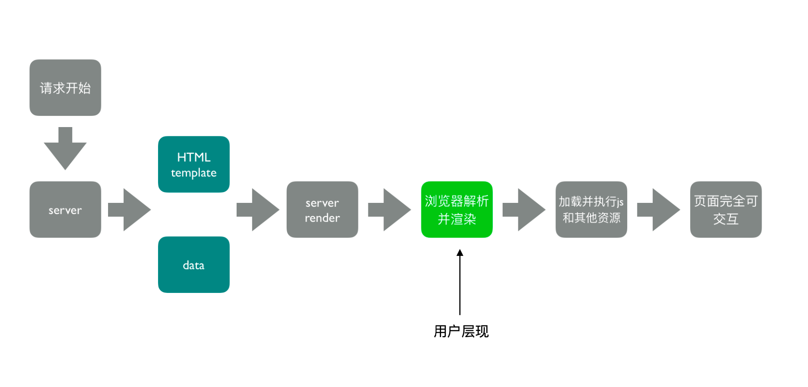
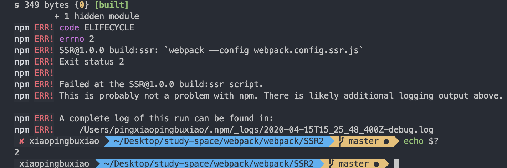

### 服务器渲染（SSR）

服务端渲染的流程如如下：

#### webpack初级配置
在上面的基础上增加 `index.server.js`。同时增加针对`webpack.config.ssr.js`。需要做的步骤包括：
1. 将组件文件改为导出一个组件。
2. 将代码中的 `import` 改为 可以识别的 `require`。
3. 服务端通过针对不同的路由渲染不同的页面。
4. **踩坑：** `webpack` 中增加了 `optimization` 将 `React` 分割为单独的包的时候反而会出现问题。
[SSR具体demo](https://github.com/xiaopingbuxiao/webpack/tree/master/SSR)

存在的问题:

**浏览器器的全局变量量 (Node.js 中没有 document, window)**
* 组件适配:将不不兼容的组件根据打包环境进⾏行行适配
* 请求适配:将 `fetch` 或者 `ajax` 发送请求的写法改成 `isomorphic-fetch` 或者 `axios`
**样式问题 (Node.js ⽆无法解析 css)**
* 方案一:服务端打包通过 `ignore-loader` 忽略略掉 `CSS` 的解析
* ⽅案二:将 `style-loader` 替换成 `isomorphic-style-loader` (css in js)

#### 引入样式的问题
将模版改为通过读取`dist`下面的`html`文件，因为打包后的`html`文件中是通过静态的资源引用了`css`的。之后通过占位符的形式，将模块中需要填充`html`的地方填充为`SSR`渲染出来的内容

#### 首页初始化的数据处理
同样是通过占位符的思路来获取到数据放在渲染的页面中。
[SSR具体demo](https://github.com/xiaopingbuxiao/webpack/tree/master/SSR2)

### 优化命令行的构建日志
**自带统计系统的 stats**

Preset        |  Alternative      | Description
--------------|-------------------|------------------
error-only    |  none      | 最在错误时候输出
minimal       |  none      | 只有在发生错误或者有新的编译时候发输出
none          |  false     | 没有输出
normal        |  true      | 标准输出
verbose       |  none      |全部输出

**使用`friendly-errors-webpack-plugin`来优化显示**

[更多friendly-errors-webpack-plugin插件信息](https://www.npmjs.com/package/friendly-errors-webpack-plugin)

### 构建异常和中断处理
在 CI/CD 的 pipline 或者发布系统需要知道当前构建状态

每次构建完成后输⼊入 echo $? 获取错误码 

`webpack4`之前的版本构建失败是不会抛出错误码的。因此可以通过Node.js 中的 process.exit 规范
* 0 变好似成功完成，回调函数中 `err` 为 `null`
* 非 0 表示执行失败，回调函数中 `err` 部位`null`，`err.code` 就是传给 `exit`的数字

**如何主动捕获并处理理构建错误**
通过利用`compiler`在每次构建结束后会触发`done`这个`hook`.调用`process.exit`主动的抛出构建报错。
[具体demo](https://github.com/xiaopingbuxiao/webpack/tree/master/SSR2)

