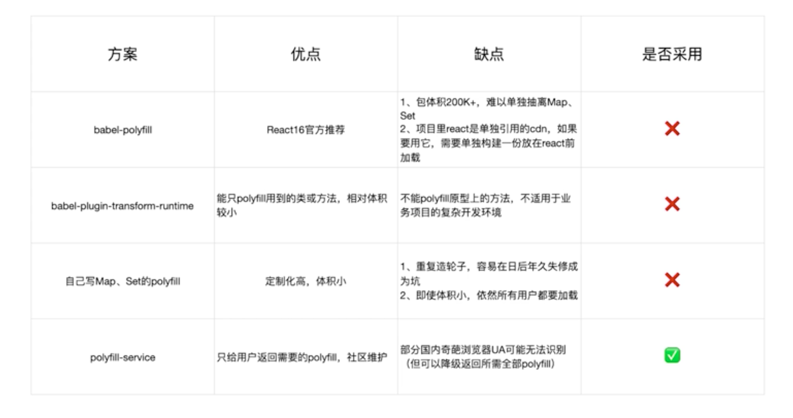

### 构建配置抽离成npm
* 通过多个配置文件管理不同环境的构建
* 将构建配置设计成一个库，如：`neutrino、webpack-blocks`
* 抽离成一个工具进行管理：如: `create-react-app`,`kyt`,`nwb`
* 将所有的配置放在一个文件，通过`--env`参数来控制分支选择


[涵盖基本功能的demo](https://github.com/xiaopingbuxiao/webpack/tree/master/my-project)


### 添加测试文件

[demo](https://github.com/xiaopingbuxiao/webpack/tree/master/my-project02)


### 持续集成

**接入 `Travis CI`**


### git 规范和 changelog 生成

[Commit message 和 Change log 编写指南](https://www.ruanyifeng.com/blog/2016/01/commit_message_change_log.html)

```shell
npm install husky @commitlint/config-conventional @commitlint/cli -save-dev
```
```json package.json
{
  // ....
  "husky": {
    "hooks": {
      "commit-msg": "commitlint -E HUSKY_GIT_PARAMS"
    }
  }
}
```

增加 `commitlint.config.js` 
```js
module.exports = {
  extends: ['@commitlint/config-conventional'],
};
```
之后所有 `commit` 的信息都会被校验，不符合格式的 `commit` 会被阻止。
**第二种方式**
同时可以使用 `commitizen` 来生成来选择指定的`commit`格式。
```shell
npm install commitizen -save-dev
```
或者 
```
npm install commitizen cz-conventional-changelog -g
```
增加`.czrc`文件
```
{ "path": "cz-conventional-changelog" }
```
全局和本地依赖的使用不同。全局`git cz`。本地`npx git-cz`。如图

同时`package.json`增加脚本
```json package.json
"scripts": {
  "generate:changelog": "conventional-changelog -p angular -i CHANGELOG.md -s"
},
```
可以自动生成`CHANGELOG.md`。


### 速度分析插件
[speed-measure-webpack-plugin](https://www.npmjs.com/package/speed-measure-webpack-plugin)
查看`loader、plugin`的耗时时间，针对性的就行一些优化


### webpack 体积分析
[webpack-bundle-analyzer](https://www.npmjs.com/package/webpack-bundle-analyzer)


### 编译速度优化
[如何提高webpack的编译速度](https://github.com/ly2011/blog/issues/44)

#### 多进程/多实例构建：资源并行解析可选方案
* thread-loader 官方推荐
* parallel-webpack 使用
* happypack 使用

#### 多进程/多实例：并行压缩
* webpack-parallel-uglify-plugin 
* uglifyjs-webpack-plugin
* terser-webpack-plugin (推荐使用)

`terser-webpack-plugin` webpack4 中使用，并且 `terser-webpack-plugin` 相对于前两者支持压缩`es6`


**重要：开发编译速度提升很明显**
[demo地址](https://github.com/xiaopingbuxiao/webpack/tree/master/my-project02)


### 构建速度的优化 分包优化 

####  设置 `Externals` 
使用 [html-webpack-externals-plugin](https://www.npmjs.com/package/html-webpack-externals-plugin)

#### 使用 DLLPlugin 进行分包
思路： 将 `vue`,`vue-router`,`vuex`等基础包和业务基础包打包成一个文件 
方法： 使用 `DLLPlugin` 进行分包，`DllReferencePlugin`

[使用方式](https://webpack.docschina.org/plugins/dll-plugin/)

方法内置的插件。 


### 提升构建速度 增加缓存
缓存思路：
* `babel-loader` 开启缓存
* `terser-webpack-plugin` 开启缓存
* 使用`cache-loader` 或者`hard-source-webpack-plugin`

所有的使用配置都可以在 npm 上找到。
他们在第一次构建之后会在`node_modules`下生成一个`.cache`文件夹为缓存文件。下次构建提供加速


### 缩小构建目标 （**非常重要**）

比如使用 `babel-loader`不解析`node_modules`。
```js
module.exports = {
  module:{
    rules:{
      test:/\.js$/,
      loader:'babel-loader',
      exclude:'node_modules'
    }
  }
}
```
#### 减少文件搜索范围
* 优化 `reslove.modules`配置，减少模块搜索层级
* 优化`reslove.mainFields`配置
* 优化`reslove.extensions`配置
* 合理使用`alias`
如下：
```js
module.exports = {
  reslove:{
    alias:{
      react:path.reslove(__dirname,'./node_modules/react/dist/vue.min.js')
    },
    modules:[path.reslove(__dirname,'node-modules')],
    extensions:['.js'],
    mainFields:['main']
  }
}
```


### 无用的 css 删除

#### tree shaking 复习
概念:     
1 个模块可能有多个方法，只要其中的某个方法使用到了，则整个文件都会被打到 bundle 里面去，tree shaking 就是只把用到的方法打入 bundle ，没用到的方法会在 uglify 阶段被擦除掉。

使用:`webpack` 默认支持，在` .babelrc `里设置 `modules: false `即可  `production mode`的情况下默认开启
要求:必须是 ES6 的语法，CJS 的方式不支持


#### css 的处理

* `PurifyCSS`: 遍历代码，识别已经用到的`CSS class` 不再维护了，因此使用`purgecss-webpack-plugin`和`mini-css-extract-plugin`配合使用
* `uncss`: HTML 需要通过`jsdom`加载，所有的样式通过`PostCSS`解析，通过`document.querySelector`来识别在`html`文件里面不存在选择器


[purgecss-webpack-plugin](https://www.npmjs.com/package/purgecss-webpack-plugin) 配合`vue`使用时有问题。


### 图片压缩
要求：基于 `Node` 库 的 `imagemin` 或者 `tinypng API`      
使用：配置`image-webpack-loader`   

`imagemin` 的优点分析:
* 有很多定制选项
* 可以引入很多第三方优化插件,例如 `pngquart`
* 可以处理多种图片格式


### 动态 polyfill



`polyfill` 会识别`User Agent`，下发不同的`polyfill`

`polyfill.io` 官方提供的服务:
```js
 <script src="https://cdn.polyfill.io/v2/polyfill.min.js"></script>
```
基于官方自建`polyfill`服务


### loader-runner 的使用（loader的调试）

[loader-runner使用](https://www.npmjs.com/package/loader-runner)

### loader 的参数获取
通过`loader-utils`的`getOptions`方法获取
```js
const loaderUtils = require("loader-utils");
module.exports = function(content) {
  const { name } = loaderUtils.getOptions(this);
};
```
### loader 的异常处理
* `loader`内直接通过`throw`抛出
* 通过`this.callback`抛出
```js
this.callback(
  err:Error|null,
  context:string|Buffer,
  sourceMap?:SourceMap,
  meta?:any
)
```
### loader 的异步处理
通过 `this.async` 来返回一个异步函数
* 第一个参数是`Error`，第二个参数是处理结果
```js
module.exports = function(input) { 
  const callback = this.async();
// No callback -> return synchronous results // if (callback) { ... }
  callback(null, input + input); 
};
```
### loader 中使用缓存
`webpack` 中默认开启`loader`缓存    
* 可以使用`this.cacheable(false)`关闭缓存

缓存条件:`loader`的解惑在相同的输入下有确定的输出
* 有依赖的`loader`无法使用缓存

### loader 进行文件输出
通过`this.emitFile`进行文件写入 
```js
const loaderUtils = require("loader-utils");
module.exports = function (content) {
  const url = loaderUtils.interpolateName(this, "[hash].[ext]", {
    content,
  });
  this.emitFile(url, content);
  const path = `__webpack_public_path__ + ${JSON.stringify(url)};`;
  return `export default ${path}`;
};
```
以上关于`loader`的处理[demo]('https://github.com/xiaopingbuxiao/webpack/blob/master/raw-loader/package.json')


### 开发一个合并雪碧图的 loader


